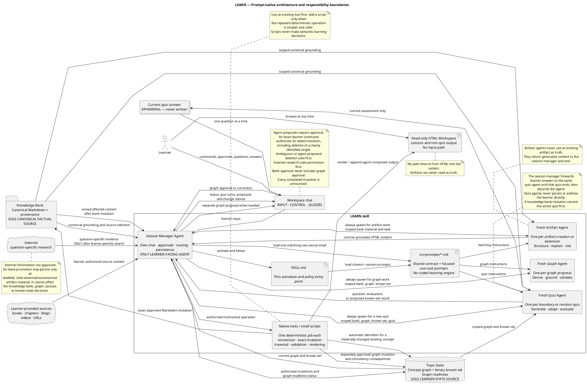
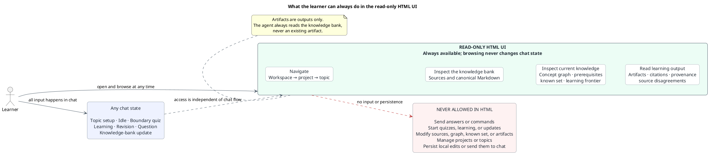

# LEARN — Product behavior specification

This document is the authoritative behavioral specification for the **LEARN** skill. It is written for agents operating inside a workspace or project directory.

The product is a source-grounded learning workspace implemented as an agent-native skill. The learner controls it entirely through chat. Quizzes run entirely in chat; lessons and other learning output appear in a read-only HTML workspace generated from a mutable knowledge bank.

## 1. Product promise

LEARN helps a learner understand a topic by:

1. Building a canonical knowledge bank from learner-selected sources.
2. Deriving a concept and prerequisite graph from that bank.
3. Maintaining a binary record of what the learner understands.
4. Recommending an unknown concept at the learner's current knowledge boundary.
5. Producing grounded learning material and assessments.
6. Letting the learner change the knowledge bank freely without restarting the topic.

The learner always has the final word about what they understand.

## 2. Activation and normal chat commands

The learner activates LEARN in chat while working inside the relevant workspace or project directory.

On activation, the agent starts or reuses a local server for the rendered workspace and gives the learner a clickable `http://localhost:<port>/` address.

Typical requests include:

- “I want to learn a new topic.”
- “Teach me the best next concept.”
- “I want to reassess my knowledge boundary.”
- “I want to review this concept.”
- “Ask me another revision question.”
- “I understand this.”
- “Mark this concept not understood.”
- “Show me the concept tree.”
- “Why is this concept a prerequisite?”
- “Add this book, article, video, or URL to the knowledge bank.”
- “Use this internet explanation as a source.”
- “Remove this source.”
- “Create, rename, select, or delete a topic.”

The agent interprets ordinary language; the learner does not need special command syntax.

When the learner says only “I want to learn,” the agent chooses the best next concept: an unknown concept closest to the known set in the prerequisite graph. The learner may choose another concept instead.

## 3. Non-negotiable principles

### 3.1 The knowledge bank is the factual source of truth

All canonical teaching content, concepts, prerequisite relationships, and quiz questions must be supportable by the active knowledge bank.

The agent must never use an existing learning artifact as factual input. Whenever it teaches, answers, assesses, or updates the graph, it reads the current knowledge bank.

### 3.2 Chat controls and quizzes; HTML presents learning material

- **All input, control, and quizzes happen in chat.** Commands, answers, approvals, corrections, knowledge declarations, quiz questions, evaluations, and quiz results stay in chat.
- **Other substantive output goes to HTML.** Lessons, grounded answers, concept views, citations, and source comparisons are published there.
- The persistence folder is the single source of truth. The fixed renderer reads and validates that semantic state, then produces the complete read-only UI as disposable output.
- Agents never author the application shell, navigation, graph drawing, graph positions, empty states, or visual styling. They persist JSON, canonical Markdown, and semantic artifact fragments only.
- Outside quizzes, chat contains only concise operational communication: what the agent is doing, what approval is required, and what changed. Those responses end with a contextual numbered list of actions the learner can take next.
- HTML is read-only. It never sends commands or answers and never persists learner input.

### 3.3 Learner authority

The agent may evaluate understanding and recommend actions, but the learner has final authority. The learner may override an assessment, name a different concept, declare a concept understood or not understood, or request more questions.

### 3.4 Binary understanding

Every concept is either:

- **understood**, or
- **not understood**.

There are no persisted scores, percentages, confidence levels, or partial-understanding states.

“Knowledge boundary” is a conversational term for the frontier between the known set and the nearest unknown concepts. The persisted state is the known set, not a separate boundary object.

### 3.5 Mutable current state, without versioning

There is one current topic state. Knowledge-bank, graph, artifact, and known-set changes update it in place.

There are no topic versions, automatic snapshots, or archived states. A knowledge-bank change does not trigger complete regeneration or mandatory reassessment.

### 3.6 Prompt-native implementation

LEARN is driven by agents and good instructions, not by a separately implemented learning engine. One session manager agent owns the learner conversation and delegates quiz and artifact generation to fresh specialist sub-agents.

- Semantic work belongs in prompts: understanding intent, extracting concepts, judging prerequisites, choosing what to teach, generating questions, evaluating answers, explaining conflicts, and writing learning material.
- The session manager and its specialists read scoped workspace files, use available tools, and perform the workflow described here.
- Small scripts may be used only for proven deterministic, repeatable chores such as file conversion, exact state mutation, simple graph traversal or validation, and HTML rendering. Do not add one speculatively.
- Scripts never decide what a concept means, whether an answer demonstrates understanding, what question to ask, or what the learner should study.
- The renderer and its fixed template own the whole visual application. Rendered HTML is replaceable build output and must never be edited as state.
- Prefer existing agent tools, native file operations, and simple scripts over new services or frameworks.
- Do not build a scoring engine, recommendation engine, workflow engine, custom orchestration runtime, or other coded substitute for agent judgment.

The intended implementation is a skill that fully uses agent reasoning. “Learning engine” means a Markdown prompt loaded by the skill and supplied to agents, not an application service or code library.

## 4. Product model

### Workspace, project, and topic

- A **workspace** is the directory context in which LEARN operates.
- A **project** groups related learning topics.
- A **topic** owns one current knowledge bank, one current concept graph, one current known set, and its learning artifacts.

### Knowledge bank

The knowledge bank is a collection of canonical Markdown files produced from learner-selected material, including:

- whole books or selected chapters;
- blogs and articles;
- websites and URLs;
- YouTube or other video material converted to Markdown;
- learner-provided text;
- internet information explicitly approved for promotion into the bank.

Original media is used to create or update its canonical Markdown. After that, agents use the Markdown—not the original media—as the source of truth. Existing unchanged Markdown must be reused rather than reparsing its original source.

The learner may add, update, or remove knowledge-bank material at any time through chat.

### V1 fail-closed source conversion

Conversion is a staged mechanical operation, not a semantic agent task. It preserves the source's wording and order as faithfully as the format allows; an LLM must not paraphrase, summarize, complete, or repair source content while creating canonical Markdown.

Use the smallest supported converter for each source:

- **Web articles:** Trafilatura. If it cannot extract faithful article content, stop.
- **DOCX and EPUB:** Pandoc.
- **Text-native PDFs:** Poppler text extraction with stable page markers in the Markdown.
- **Complex or scanned PDFs:** use Docling only as the explicit fallback. If it is unavailable or cannot produce reliable content, stop.
- **YouTube:** obtain a genuine caption transcript through available browser tools and record its language and whether captions are authored or automatically generated. If genuine captions cannot be obtained, stop; never substitute an agent-written transcript.
- **Local audio or video:** v1 requires a supplied transcript. It does not perform transcription.

Each conversion is completed outside the active knowledge bank. Embed provenance in the staged Markdown containing the original source identity, canonical Markdown destination, conversion timestamp, SHA-256 hashes of the available original content and the UTF-8 Markdown body excluding its provenance frontmatter, converter name and version, relevant source metadata, and transcript language/type when applicable. Only after both Markdown body and provenance are complete may the authorized result replace or enter the bank. Any download, extraction, conversion, validation, hashing, or provenance failure leaves the current knowledge bank and concept graph unchanged.

### Concept graph

The graph contains:

- one node per concept;
- a directed edge from prerequisite to dependent concept.

The agent defines only the semantic concepts and prerequisite relationships from the knowledge bank and persists them as JSON. The fixed renderer alone positions and draws them. The learner reviews the initial graph and may later request grounded additions, removals, or edge changes.

The graph is not a chapter-order representation. Learning recommendations use prerequisite proximity to the known set, not source order.

### Known set

The known set contains the concepts currently marked understood. It must always be prerequisite-consistent:

> If a concept is understood, every transitive prerequisite of that concept is also understood.

### Learning artifacts

A concept may have one evolving HTML learning artifact. Graph approval does not generate artifacts. A new topic starts with none; the agent creates or regenerates only the artifact for a concept the learner explicitly asks to learn, study, review, or be taught. An explicit request may name several concepts.

The stable workspace behaves like a note graph: selecting a concept node opens the artifact with the matching `conceptId`. If the artifact does not exist, the note pane remains otherwise blank and shows the muted prompt `Generate learning materials in chat.`

Artifacts are disposable presentation output, not authoritative state. They may contain older material after a knowledge-bank change. The agent informs the learner when relevant, but it does not inspect or repair artifacts merely to keep them synchronized. Every future answer or lesson is grounded again in the current knowledge bank.

### Quiz sessions

A quiz is a simple turn-by-turn chat exchange. The agent asks exactly one question, waits for the learner's answer, then briefly evaluates it and asks the next question when useful. Questions, answers, working judgments, and progress are not persisted. Only a learner-approved final known-set change may be saved.

An interrupted quiz has no durable partial state and may be restarted.

## 5. Source grounding and provenance

### Canonical material

When information comes from the knowledge bank, the HTML output must identify the supporting source precisely enough for the learner to locate it.

The product assumes the canonical Markdown correctly represents the selected source. It does not independently audit or fact-check the source during normal learning.

### Conflicting sources

When knowledge-bank sources disagree, the agent must:

1. State that they disagree.
2. Attribute each position to its source.
3. Explain the disagreement without fabricating a resolution.
4. Avoid silently favoring one source.

### External internet information

When the knowledge bank cannot answer a learner's specific question, the agent must tell the learner that the bank is insufficient. It may then offer two choices: authorize an internet search or provide another source.

The agent must not search the internet until the learner explicitly approves. A direct instruction such as “search the internet” already counts as that approval. If the learner declines and provides no source, the agent explains that it cannot produce a grounded answer.

After research is authorized, the agent must:

- use only what is necessary to answer the question;
- label the material clearly as **external information**;
- cite the external source;
- distinguish it visually from knowledge-bank material;
- exclude it from the concept graph and every quiz.

The answer is appended to the relevant learning artifact as labelled external material.

After publishing the external answer, the agent must offer to add the external source or information to the knowledge bank. It becomes canonical only after explicit learner approval. Once promoted, it is ordinary knowledge-bank material and may affect the graph, learning, answers, and future quizzes.

An external answer produced after the learner authorizes research may remain visibly persisted in the relevant HTML artifact. It must remain labelled **external** and **noncanonical** until separately promoted into the knowledge bank. Persisting that learner-facing answer does not authorize it to influence the concept graph, quiz questions, recommendations, or known-state decisions. Research notes, fetched material not included in the published answer, and specialist working context remain ephemeral.

## 6. Creating a topic

For a new topic, the agent:

1. Confirms the intended topic and source scope when it is ambiguous.
2. Stages the selected sources under the v1 fail-closed conversion contract and promotes only complete Markdown plus provenance.
3. Stops without creating a graph if the selected material cannot be parsed reliably.
4. Derives a grounded concept and prerequisite graph.
5. Shows the graph in HTML and asks the learner to approve or correct it.
6. After approval, leaves learning artifacts empty until the learner requests one.
7. Establishes the initial known set through a knowledge-boundary finder, direct learner declarations, or an explicitly empty known set.
8. Shows the current graph, known set, and learning frontier in HTML.

No quiz data is retained after initialization.

## 7. Updating the knowledge bank and graph

Knowledge-bank changes are designed to be ordinary and friendly, especially when adding useful sources discovered during learning.

The agent updates only the current state. It does not create a version or rebuild unrelated state.

Every knowledge-bank change and any resulting graph change are two separate decisions:

1. The learner authorizes the knowledge-bank addition, update, or removal.
2. The agent applies that change to the canonical Markdown. If it materially changes an existing concept, the agent also marks that concept and its dependent descendants not understood, then reports these automatic consequences.
3. The agent rereads the affected bank material and decides whether the concept graph should change.
4. If a graph change is needed, the agent shows the proposed concepts, edges, and known-set consequences and requests separate learner approval.
5. The learner may approve or correct the proposal. The agent and learner iterate until they agree.
6. Only then does the agent persist the graph change and its prerequisite-consistency consequences.

Approval to mutate the knowledge bank never silently authorizes a graph mutation. If no graph change is needed, the agent says so and continues without another approval.

When a graph change is required to make the graph match the updated bank, normal learning from that graph waits until the learner and agent agree on the reconciliation. The updated bank remains the factual source of truth during that discussion.

The session manager records that graph reconciliation is required and treats the previously approved graph as unavailable for graph-dependent work. Concept recommendation, boundary finding, revision assessment, and concept learning that depend on the unresolved graph remain blocked until the learner approves or corrects the proposal and the agent persists a grounded graph. The learner may still inspect the bank, ask bank-grounded questions, or continue the reconciliation. An unapproved proposal is not durable state.

If the learner authorizes any knowledge-bank mutation while a boundary or revision quiz is active, the session manager first cancels that quiz, ends its quiz sub-agent, and discards every uncommitted question, answer, judgment, and proposed result. The bank mutation then proceeds normally. Continuing assessment requires a new quiz with a fresh quiz sub-agent and current bank and graph context.

### Required consequences

| Knowledge-bank change | Graph proposal the agent may make | Known-set handling |
|---|---|---|
| Add a source | Add or adjust only concepts and edges grounded by the new source | After graph approval, new concepts default to not understood; preserve other state unless consistency requires a change |
| Add material describing a new prerequisite of an understood concept | Add the concept and prerequisite edge | After graph approval, infer the new prerequisite and all of its prerequisite ancestors as understood |
| Remove source material supporting a concept | Remove the unsupported node and its incident edges | After graph approval, remove its known-state entry; retain remaining consistent state |
| Add or remove prerequisite support | Add or remove the affected edge | After graph approval, restore prerequisite consistency using the rules below |
| Materially change what an existing concept means or covers | Adjust the node only if the graph itself must change | Immediately mark the existing concept and its dependent descendants not understood as part of applying the approved bank update |

The “new concept is not understood” default has one deliberate exception: when the new concept is introduced as a prerequisite of an already-understood concept, prerequisite consistency implies that the learner understands it. That inference wins.

### Consistency operations

- Marking a concept **understood** marks every transitive prerequisite understood.
- Marking a concept **not understood** marks every transitive dependent not understood.
- Adding a prerequisite beneath an understood concept marks that prerequisite and its transitive prerequisites understood.
- Removing a prerequisite does not demote any concept.
- A material source change demotes the affected concept and its transitive dependents.

The agent explains every automatic consequence. The learner may immediately override it or request the boundary finder.

### Graph grounding

Every concept and edge in the active graph must remain grounded in the knowledge bank. After a bank mutation makes the last approved graph require reconciliation, that graph may remain on disk for inspection but is not active and must not drive learning or assessment. If the learner requests a concept unsupported by the bank, the agent explains that a source must first be added or approved.

## 8. Choosing what to learn

When asked to choose, the agent selects an unknown concept closest to the known set while respecting prerequisite relationships.

If several concepts are equally close, the agent chooses the one it judges most useful from the graph and briefly explains the choice. It does not use book chapter order as the deciding rule.

The learner may always name another concept.

For the selected concept, the session manager:

1. Announces in chat what it is preparing.
2. Selects the relevant current knowledge-bank context.
3. Spawns a fresh learning-artifact sub-agent with `src/prompts/learn.md`, the task, and the scoped bank material.
4. Receives the grounded, structured artifact content and publishes it to HTML.
5. Ends the sub-agent and tells the learner in chat where the output is ready and what a sensible next action is.

## 9. Knowledge-boundary finder

The boundary finder establishes or reassesses the known set. The learner may request it at any time; knowledge-bank changes do not force it automatically.

The session manager always spawns a fresh boundary-quiz sub-agent for the complete quiz. It forwards each chat answer to that same sub-agent, relays one next question at a time in chat, and ends the sub-agent when the quiz is approved or abandoned.

A knowledge-bank mutation abandons the active boundary quiz before the mutation is applied. Its progress is discarded; reassessment starts later as a new quiz with a fresh sub-agent.

The quiz is adaptive and binary-search-like, not a literal ordered binary search:

1. Choose a concept whose answer will best reduce uncertainty about the known set.
2. Ask one grounded question in chat and wait for the learner's answer.
3. Receive the learner's answer in chat.
4. Evaluate it briefly and reasonably, without pedantry.
5. Choose and ask exactly one next question from the graph, prior question, and answer.
6. Prefer one or two additional checks when useful, but stop when the result is sufficiently clear.

At completion, the agent shows a concise proposed prerequisite-consistent known set in chat. The learner may:

- approve it;
- correct it directly;
- request more questions; or
- reject the assessment.

Only the approved result is persisted. Questions, answers, evaluation notes, and progress are discarded.

## 10. Revision and review

The learner may review any concept, whether or not it is currently understood.

The agent regenerates the review material from the current knowledge bank and publishes it to HTML. It does not trust an existing artifact as input.

If the learner requests assessment, the revision quiz asks a reasonable number of grounded questions. The agent decides whether the answers demonstrate practical understanding without demanding irrelevant precision.

The session manager always spawns a fresh revision-quiz sub-agent for the complete revision quiz. If the result leads to new or extended learning material, the session manager spawns a separate fresh learning-artifact sub-agent for that artifact work.

A knowledge-bank mutation abandons the active revision quiz before the mutation is applied. Its progress is discarded; any later revision assessment uses a fresh quiz sub-agent and current grounding.

The outcome is a proposal:

- **Understood:** propose marking the concept and its prerequisites understood.
- **Gap remains:** explain the gap briefly in chat, add appropriate learning material in HTML, and propose leaving or marking the concept and its dependents not understood.

The learner approves, corrects, continues learning, or directly declares the result. Only the final known-set change persists.

The learner may bypass the quiz by explicitly saying “I understand this,” “mark this understood,” “I do not understand this,” or equivalent. The direct instruction is authoritative.

## 11. Asking questions

The learner asks every question in chat. The substantive answer is generated by a fresh learning-artifact sub-agent and published to HTML. The sub-agent receives only the scoped current knowledge-bank material and any explicitly authorized external evidence.

The agent follows this order:

1. Read the current knowledge bank.
2. Answer fully from the bank when possible and cite the relevant sources.
3. If sources conflict, show all relevant positions and the disagreement.
4. If the bank is insufficient, tell the learner and ask permission to search the internet or ask them to provide another source.
5. If permission is denied and no source is provided, do not answer beyond explaining that the available bank is insufficient.
6. If permission is given, research only the specific question and publish a cited answer labelled external.
7. Offer to promote the external source into the knowledge bank.
8. If promotion is approved, update the bank first; then separately propose and obtain approval for any graph changes.

External information that is not promoted remains outside the knowledge bank, graph, quizzes, recommendations, and known-state decisions, even when its labelled noncanonical answer persists in an artifact.

## 12. Approval and communication

The agent must be transparent without turning every action into an approval ceremony.

### Before work

In a few sentences, state what is being done and mention whether persistent state may change. For longer operations, provide brief meaningful progress updates.

### When approval is required

- An agent-proposed persistent change requires explicit learner approval.
- A direct and exact learner command already authorizes the stated mutation, including a clearly identified deletion such as “remove this source”; do not ask again.
- Internet research requires explicit learner permission before searching. A direct request to search the internet already counts as permission.
- Ambiguous deletion intent and every agent-proposed deletion require explicit approval before anything is removed.
- Knowledge-bank approval and graph approval are always separate. Adding or changing a source never silently changes the graph.
- One graph approval may cover the proposed graph mutation and its clearly explained prerequisite-consistency consequences.
- Never hide a bank, graph, known-set, project, or topic mutation inside a teaching action.

### After persistence

Always tell the learner what was persisted, including automatic graph or known-set consequences. Keep this short but specific.

Every learner-facing response outside an active quiz ends with a contextual numbered list of available actions, such as learning a new concept, revising one, taking a knowledge-boundary quiz, asking a grounded question, or changing sources. During a quiz, each turn contains only a brief evaluation when applicable and exactly one question, then waits for the learner's answer.

When an HTML result or proposal is ready, its clickable link comes first. A graph-proposal message then gives one direct sentence followed by its numbered actions; it does not repeat source or topic background already visible in the proposal.

### Examples

- “I understand this” authorizes the known-set update and required prerequisite closure.
- “Search the internet for this” authorizes the search, but not promotion of the result into the knowledge bank.
- “Add this article to the knowledge bank” authorizes the bank addition, but not a later concept-graph mutation. The agent evaluates the updated bank and requests separate graph approval when needed.
- “Remove this source” authorizes immediate deletion when “this source” identifies one exact source. The agent performs it and reports the deletion and any consequences clearly.
- “I do not like this source” is ambiguous. The agent asks whether the learner wants it removed before deleting anything.
- An agent suggestion such as “This external explanation would improve the bank” changes nothing until the learner approves it.

## 13. Read-only HTML contract

The learner can browse the HTML workspace at any time, regardless of what is happening in chat.

HTML may display:

- workspace, project, and topic navigation;
- knowledge-bank sources and canonical Markdown;
- the concept graph and prerequisite relationships;
- understood and not-understood concepts;
- the current learning frontier;
- learning artifacts;
- citations, provenance, and source disagreements;

HTML must never:

- send a chat message or quiz answer;
- start learning, review, assessment, or research;
- modify the knowledge bank, graph, known set, or artifacts;
- create, rename, select, or delete projects or topics;
- persist text entered into a local field;
- change the active chat flow.

Navigation or other local display controls may exist, but their effects are presentation-only and are never sent to chat or persisted.

Durable HTML files may contain the workspace and learning artifacts. Quiz questions, progress, results, and approval stay in chat and never become HTML or durable topic content. Temporary HTML for other unapproved proposals remains session-scoped and is removed when the proposal ends or is abandoned.

## 14. Persistent and ephemeral state

### Persisted

- workspace, project, and topic structure;
- canonical knowledge-bank Markdown and provenance;
- current concept graph;
- current binary known set;
- current learning artifacts, including clearly labelled external/noncanonical answer sections;
- minimal topic metadata indicating that graph reconciliation is required after a bank change, when applicable.

### Ephemeral

- quiz questions and answers;
- quiz progress and intermediate judgments;
- unapproved graph or state proposals;
- internet research notes, unused fetched material, and specialist working context;
- local interactions inside the HTML UI.

## 15. Architecture and responsibilities

LEARN should remain a small prompt-native skill. The agent environment is the runtime; the skill supplies behavior and constraints.

### Minimal skill shape

```text
LEARN/
├── SKILL.md
└── src/
    ├── prompts/
    │   ├── shared.md
    │   ├── session_manager.md
    │   ├── create_concept_graph.md
    │   ├── learn.md
    │   ├── knowledge_boundary_quiz.md
    │   └── revision_quiz.md
    └── scripts/                  # optional; create only when a deterministic helper is justified
```

- **`SKILL.md`:** thin entry point. Activates LEARN, starts the session manager, identifies the workspace/topic, and routes to the prompt files.
- **`src/prompts/shared.md`:** common grounding, state, approval, rendering, conversion, and implementation rules.
- **`src/prompts/session_manager.md`:** learner-facing coordination, localhost serving, routing, persistence, and next-action behavior.
- **Use-case prompts:** one focused file for graph creation, learning artifacts, knowledge-boundary quizzes, and revision quizzes.
- **`src/scripts/`:** optional small helpers called by the agent. Each helper performs one deterministic task and contains no learning judgment.
- **Session manager agent:** owns the learner conversation, approvals, current flow, and persistence. It delegates heavy semantic generation and remains the only agent that communicates with the learner.
- **Quiz sub-agent:** a fresh specialist spawned for each complete boundary-finder or revision-quiz session.
- **Learning-artifact sub-agent:** a fresh specialist spawned for each creation or extension of a learning artifact.
- **Knowledge bank:** canonical topic Markdown and provenance; the sole canonical factual source.
- **Topic state:** current concept graph and binary known set; the sole learner-state source.
- **HTML workspace:** read-only projection containing learning material and other non-quiz substantive output.

The directory names may be adjusted to the host skill convention, but the boundary must remain: a thin skill entry point, shared rules, focused use-case prompts, one session manager, fresh task specialists, and only the smallest necessary deterministic helpers.

### Prompt versus script boundary

| Belongs to the agent prompt | May belong to a small script |
|---|---|
| Interpret natural-language intent | Create or locate predictable directories and files |
| Derive concepts and prerequisite meaning | Run the staged fail-closed source conversion with the specified existing tools |
| Decide whether a source change materially changes a concept | Apply an already-approved exact file/state mutation |
| Choose the next concept and resolve semantic ties | Find prerequisite ancestors or dependent descendants |
| Generate adaptive quiz questions | Validate simple structural invariants |
| Evaluate understanding reasonably | Render or refresh deterministic HTML structure |
| Explain sources, conflicts, and learning gaps | Perform other mechanical operations that are shorter and safer than repeating them manually |
| Compose lessons, reviews, and cited answers | — |

A helper receives an already-decided instruction and returns a mechanical result. It must not embed prompts, scoring rules, educational heuristics, or policy decisions.

### Explicitly not part of the design

- No coded learning-engine service or class hierarchy.
- No custom scoring or mastery algorithm.
- No algorithmic question bank or fixed decision tree.
- No recommendation service beyond graph inspection plus agent judgment.
- No autonomous backend workflow, queue, or scheduler.
- No database, vector store, embeddings pipeline, or framework unless a demonstrated future requirement makes plain files insufficient.
- No interactive frontend state: HTML remains a read-only projection.

No component duplicates authority. The knowledge bank owns canonical knowledge; topic state owns learner state; prompts define behavior; artifacts remain outputs.



## 16. Chat commands and learning flows

```plantuml
@startuml
title Chat commands and learning flows

skinparam shadowing false
skinparam ArrowColor #667085
skinparam activity {
  BorderColor #475467
  FontColor #101828
  DiamondBorderColor #475467
  DiamondBackgroundColor #FFFFFF
  StartColor #344054
  EndColor #344054
}

legend
|= Color |= Meaning |
|<#F2F4F7>| Chat input, approval, or brief status |
|<#EAF2FF>| Substantive output written to HTML |
|<#FFF4CC>| Quiz turn in chat — never persisted |
|<#E8F7EC>| Persistent topic-state change |
endlegend

start
#F2F4F7:Learner activates **LEARN** in the workspace/project chat;
:Agent loads the topic's knowledge bank, graph, and known set;
#F2F4F7:Agent briefly states the current state and available actions;

repeat
  #F2F4F7:Learner sends a command in chat;
  #F2F4F7:Agent states what it will do and whether state may change;
  note right
    If this is a knowledge-bank mutation during an active quiz,
    cancel the quiz, discard its progress, and end its agent first.
  end note

  if (Learning or assessment?) then (yes)
    if (Reassess knowledge boundary?) then (boundary finder)
      :Session manager spawns a fresh Boundary Quiz Agent;
      repeat
        #FFF4CC:Choose an informative concept from the graph and prior answers;
        #FFF4CC:Ask exactly one grounded question in chat;
        #F2F4F7:Learner answers in chat;
        #FFF4CC:Evaluate briefly and adapt;
      repeat while (More evidence useful?) is (yes)
      #FFF4CC:Show the proposed binary known set in chat;
      #F2F4F7:Learner approves, corrects, or requests more questions;
      while (More questions requested?) is (yes)
        #FFF4CC:Ask exactly one adaptive grounded question in chat;
        #F2F4F7:Learner answers in chat;
        #FFF4CC:Update the ephemeral assessment;
        #FFF4CC:Refresh the proposed known set in chat;
      endwhile (no)
      #E8F7EC:Persist only the learner-approved consistent known set;
      :End and discard the Boundary Quiz Agent;
    else (learn or review)
      if (Learn best next concept?) then (new learning)
        :Choose an unknown concept closest to the known boundary;
        #F2F4F7:Learner may accept it or name another concept;
      else (review)
        #F2F4F7:Learner names the concept to review;
      endif
      :Session manager spawns a fresh Learning Artifact Agent;
      :Artifact agent reads scoped knowledge-bank material only;
      #EAF2FF:Publish grounded lesson/review material with attribution;
      :End the Learning Artifact Agent;
      if (Learner requests revision quiz?) then (yes)
        :Session manager spawns a fresh Revision Quiz Agent;
        repeat
          #FFF4CC:Ask exactly one source-grounded question in chat;
          #F2F4F7:Learner answers in chat;
          #FFF4CC:Evaluate briefly without percentages or pedantry;
        repeat while (More evidence useful?) is (yes)
        #FFF4CC:Show the result and gaps in chat;
        #F2F4F7:Learner approves, corrects, or continues learning;
        #E8F7EC:Persist only the learner-approved consistent result;
        :End and discard the Revision Quiz Agent;
      endif
    endif

  elseif (Question or graph consultation?) then (yes)
    if (Ask a question?) then (question)
      :Read the current knowledge bank first;
      if (Knowledge bank answers it?) then (yes)
        :Spawn a fresh Learning Artifact Agent for the answer;
        #EAF2FF:Publish the grounded cited answer to HTML;
        :End the Learning Artifact Agent;
      else (outside bank)
        #F2F4F7:Tell learner the bank is insufficient;
        #F2F4F7:Ask permission to search the internet\nor request another source;
        if (Learner authorizes internet research?) then (yes)
          :Research only what is needed;
          :Spawn a fresh Learning Artifact Agent with\nthe approved external evidence and clear label;
          #EAF2FF:Publish a labelled external answer with citations;
          :End the Learning Artifact Agent;
          #F2F4F7:Offer to promote the source into the bank;
          if (Learner approves promotion?) then (yes)
            #E8F7EC:Add canonical Markdown to the knowledge bank;
            :Apply any automatic material-concept demotion;
            :Evaluate whether the graph should change;
            if (Graph change needed?) then (yes)
              #F2F4F7:Mark the graph as requiring reconciliation;
              #F2F4F7:Block graph-dependent learning and assessment;
              #EAF2FF:Show proposed concepts, edges,\nand known-set consequences;
              #F2F4F7:Request separate graph approval or correction;
              #E8F7EC:Persist only the agreed graph and consistent known set;
              #E8F7EC:Clear the reconciliation-required state;
            endif
            #EAF2FF:Refresh the relevant HTML views;
          endif
        else (no)
          #F2F4F7:Do not search or produce an ungrounded answer;
        endif
      endif
    else (consult graph)
      :Read the current graph and known set;
      #EAF2FF:Show concepts, prerequisites, known set, and frontier in HTML;
    endif

  else (persistent change or administration)
    if (Update knowledge bank?) then (bank)
      :Identify the addition, update, or removal;
      if (Exact learner mutation command?) then (already approved)
      else (proposal or ambiguous intent)
        #F2F4F7:Obtain explicit approval;
        note right: Exact deletion commands need no redundant confirmation.
      endif
      #E8F7EC:Update canonical Markdown in place;
      :Detect material changes to existing concepts;
      #E8F7EC:When required, mark materially changed concepts\nand their dependents not understood;
      #F2F4F7:Report the completed bank mutation;
      :Evaluate whether the graph should change;
      if (Graph change needed?) then (yes)
        #F2F4F7:Mark the graph as requiring reconciliation;
        #F2F4F7:Block graph-dependent learning and assessment;
        #EAF2FF:Show proposed concepts, edges,\nand known-set consequences;
        #F2F4F7:Request separate graph approval or correction;
        #E8F7EC:Persist only the agreed grounded graph change;
        #E8F7EC:Restore known-set consistency;
        #E8F7EC:Clear the reconciliation-required state;
        note right
          New concept -> unknown.
          New prerequisite of known concept -> inferred known.
          Removed concept -> remove its state.
          Materially changed concept -> unknown,
          with dependents also unknown.
        end note
      else (no)
        #F2F4F7:Tell learner that no graph change is needed;
      endif
      #EAF2FF:Show the updated bank, graph, known set, and frontier;
    elseif (Explicit knowledge declaration?) then (yes)
      #F2F4F7:Learner marks a concept understood or not understood;
      #E8F7EC:Apply prerequisite or dependent closure;
      #EAF2FF:Show the updated known set and frontier;
    else (manage project/topic)
      if (Deletion requested or proposed?) then (yes)
        if (Exact learner deletion command?) then (already approved)
        else (ambiguous or agent-proposed)
          #F2F4F7:Obtain explicit deletion approval;
        endif
      endif
      #E8F7EC:Create, rename, select, or delete as authorized;
      #EAF2FF:Show the resulting workspace/topic view;
    endif
  endif

  #F2F4F7:Agent reports completion and every persistent consequence briefly;
repeat while (Learner sends another command?) is (yes)
stop
@enduml
```



## 17. What the learner can always do in the HTML UI



## 18. Acceptance invariants

An implementation conforms only if all of these remain true:

1. The current knowledge bank is the sole canonical factual source.
2. The agent never treats a learning artifact as input or truth.
3. Every canonical concept, edge, lesson, and quiz question is grounded in the bank.
4. External information is cited and clearly labelled. Its published artifact section may persist as noncanonical output, but it is excluded from the bank, graph, quizzes, and known-state decisions until promoted.
5. Conflicting sources remain attributed; the agent does not invent agreement.
6. Understanding is binary and the known set is always prerequisite-consistent.
7. The learner can override every inferred knowledge judgment.
8. New concepts default to unknown, except new prerequisites implied known by an already-known dependent.
9. Materially changed concepts and their dependents become unknown.
10. The boundary finder is available on request but is not forced after every change.
11. Quiz contents and progress are never persisted; a bank mutation cancels an active quiz and discards its uncommitted work.
12. Chat is the only input/control surface.
13. Every quiz runs entirely in chat, one question and one learner answer at a time; lessons and other substantive learning output are published to HTML.
14. HTML remains read-only and browsing it never changes chat state.
15. Agent-proposed persistence waits for approval; exact learner commands count as approval, including deletion of a clearly identified target; ambiguous and agent-proposed deletion asks first.
16. The agent obtains permission before searching the internet unless the learner directly requested the search.
17. Permission to search does not authorize promotion into the knowledge bank.
18. A knowledge-bank mutation and a resulting graph mutation always receive separate approval.
19. A graph requiring reconciliation is unavailable for graph-dependent learning and assessment until the learner approves a grounded replacement.
20. Every completed persistent change is announced with its automatic consequences.
21. Knowledge-bank and graph changes update the current state in place.
22. No product versioning or archive behavior is introduced.
23. Existing known state is preserved unless grounding or prerequisite consistency requires a change.
24. Learning recommendations come from the graph frontier, not source order.
25. Semantic learning behavior lives in prompts and is executed by the session manager and its specialist sub-agents.
26. There is no separately coded learning engine, scoring engine, or workflow runtime.
27. Scripts are small, deterministic, single-purpose helpers and make no educational judgments.
28. Existing tools and plain files are preferred over new services, frameworks, or infrastructure.
29. Source conversion uses the specified v1 converter by format, preserves source content mechanically, records complete provenance, and cannot mutate the bank or graph on failure.
30. Activation starts or reuses the localhost workspace server and gives the learner its clickable address.
31. Every learner-facing response outside an active quiz ends with a contextual numbered list of next actions.
32. Every graph proposal uses a fresh graph specialist.
33. Graph approval never generates learning artifacts; concept artifacts are created on explicit learner request.

## 19. Agent execution checklist

Before every substantive action, an agent should be able to answer:

1. What did the learner ask for in chat?
2. Which topic and current state are active?
3. What does the current knowledge bank support?
4. Is the intended output canonical, conflicting, or external?
5. If internet research is needed, has the learner authorized it?
6. Will anything persistent change, and is that exact mutation authorized?
7. If source conversion is involved, are the staged Markdown, hashes, and provenance complete before any bank mutation?
8. If the knowledge bank changed, does the graph also need a separately approved change?
9. If a quiz is active, does this action require cancelling it and discarding its progress?
10. Is the graph active, or must graph-dependent work wait for reconciliation?
11. What must be written to durable HTML, and what must remain a temporary projection?
12. What short status or completion message belongs in chat?
13. After the action, is the active concept graph grounded and the known set prerequisite-consistent?

If any factual claim cannot be traced to the knowledge bank or clearly labelled external evidence, it must not be presented as canonical learning content.

## 20. Implementation Details

### 20.1 Implementation stance

LEARN is a skill for an intelligent agent, not a conventional learning application with an intelligence layer recreated in code.

This boundary is normative: the agent is the intelligence and the learning engine is the prompt set. One session-manager agent owns chat, state, permissions, and delegation. Fresh specialists load `src/prompts/shared.md` plus the single matching use-case prompt. When behavior needs improvement, improve those prompts before considering code.

The agent is the brain and the algorithm. The implementation gives it:

- precise behavioral prompts;
- a clear folder and file structure;
- simple persistent state;
- a read-only HTML surface for expression;
- deterministic tools only where they remove repetitive mechanical work.

Do not translate agent capabilities into custom algorithms. Concept discovery, prerequisite judgment, adaptive questioning, answer evaluation, learning-path selection, explanation, and artifact structure all remain agent reasoning tasks.

The first implementation should use ordinary folders and files. Markdown stores canonical knowledge, JSON may store structured topic state, and HTML stores learner-facing output. No database, service layer, queue, embeddings system, or application framework is needed.

Small scripts are optional, not a goal. Start without them. Add one only when a repeated operation is completely deterministic and a short script is demonstrably simpler or safer than repeating native tool calls.

Source conversion follows the v1 fail-closed hybrid defined under **Knowledge bank**: Trafilatura for web articles, Pandoc for DOCX/EPUB, Poppler with page markers for text-native PDFs, explicit Docling fallback for complex/scanned PDFs, and genuine YouTube captions obtained through available browser tools. Local audio/video requires a transcript. Conversion stays staged until its mechanical output and provenance are complete; it never becomes a new service or semantic architecture layer.

### 20.2 Minimal runtime roles

#### Session manager agent

One long-lived session manager owns the active learner session. It is the only agent that communicates with the learner.

It is responsible for:

- activating LEARN and loading the active project/topic;
- starting or reusing the localhost workspace server and sharing its clickable address;
- interpreting learner intent;
- reading the current knowledge bank, graph, and known set;
- giving concise chat status messages;
- relaying each quiz as one question, one learner answer, then the next question in chat;
- requesting required permissions and approvals;
- deciding which specialist task is needed;
- spawning and briefing specialist sub-agents;
- passing quiz answers from chat to the active quiz sub-agent;
- cancelling an active quiz and discarding its uncommitted context before any knowledge-bank mutation;
- publishing non-quiz specialist output to HTML;
- applying only authorized persistent mutations;
- recording and enforcing graph-reconciliation-required state after a bank mutation when necessary;
- reporting every completed persistent change;
- ending every learner-facing response outside an active quiz with a contextual numbered action list;
- ending disposable sub-agents when their task is complete.

The session manager coordinates. It should not duplicate the specialist's artifact design or quiz reasoning after delegation.

#### Quiz sub-agent

The session manager must spawn a fresh quiz sub-agent whenever it starts either:

- a knowledge-boundary finder quiz; or
- a revision quiz.

One quiz sub-agent owns one complete quiz, not merely one question. The session manager sends each learner answer to the same sub-agent so it can adapt the next question from the graph and prior answers.

The quiz sub-agent:

- reads only the scoped canonical knowledge-bank material supplied or identified for it;
- receives the relevant concept graph and known set;
- generates grounded questions one at a time;
- evaluates answers reasonably and without pedantry;
- decides whether another question is useful;
- returns questions, evaluations, gaps, and the proposed known-set outcome to the session manager;
- never writes persistent state;
- never communicates directly with the learner.

The session manager keeps the entire quiz in chat: it relays exactly one question, waits for the learner's answer, then gives the specialist's brief evaluation and relays exactly one next question when useful. It also presents the final result and obtains approval in chat. When the quiz is approved, rejected without continuation, abandoned, or cancelled by a knowledge-bank mutation, the quiz sub-agent ends. Its working context is not persisted. Any later assessment is a new complete quiz with a fresh sub-agent.

#### Learning-artifact sub-agent

The session manager must spawn a fresh learning-artifact sub-agent for every artifact creation or extension, including:

- teaching a new concept;
- reviewing a concept;
- appending gap-focused material after revision;
- answering a learner's substantive question;
- producing an explicitly authorized external answer.

The artifact sub-agent:

- receives one narrowly defined artifact task;
- receives the relevant current knowledge-bank Markdown;
- receives the learner's relevant known-set context;
- receives external evidence only when internet research was explicitly authorized;
- structures and writes the substantive HTML content;
- returns that content to the session manager;
- never persists files or known state;
- never communicates directly with the learner;
- ends after returning the requested content.

The artifact sub-agent must not use an existing artifact as factual or semantic input. For an extension, it creates a self-contained new section from the current knowledge bank; the session manager appends it mechanically. For a full replacement requested by the learner, it creates a new complete artifact from the bank. Graph approval never starts artifact sub-agents; concept artifacts are generated only for concepts the learner explicitly requests.

#### Concept-graph sub-agent

The session manager uses a fresh concept-graph sub-agent for every initial graph or reconciliation proposal. It receives current canonical Markdown plus relevant graph and known-set context, and returns one complete grounded acyclic graph proposal. It never persists state or communicates with the learner.

### 20.3 Specialist prompt handoff

Every spawned specialist receives a focused handoff containing only what it needs:

1. Its role: concept graph, boundary quiz, revision quiz, or learning artifact.
2. The exact learner request and desired output.
3. The relevant concept or assessment goal.
4. The scoped canonical knowledge-bank files.
5. The relevant graph and binary known-set context.
6. The source-attribution and external-information rules.
7. The required response contract for returning work to the session manager.

Do not send unrelated project history or artifacts. More context is not automatically better; the smallest complete grounding reduces confusion and keeps the specialist focused.

### 20.4 Use-case prompts

`src/prompts/shared.md` contains only common invariants. `session_manager.md` owns coordination, and each specialist loads exactly one focused prompt: `create_concept_graph.md`, `learn.md`, `knowledge_boundary_quiz.md`, or `revision_quiz.md`.

The shared contract must instruct every agent to:

- treat canonical knowledge-bank Markdown as the sole canonical factual source;
- never invent unsupported facts, concepts, or prerequisites;
- identify the source of substantive claims;
- show source disagreements explicitly and without bias;
- label authorized internet material as external until separately promoted;
- never use learning artifacts as factual input;
- preserve the boundary: quizzes entirely in chat, other substantive learning output in HTML;
- keep persistent actions explicit and report completed mutations;
- prefer direct, simple behavior over elaborate process.

For learning artifacts, the prompt must additionally require:

- explain the concept from the ground up;
- define every necessary term before relying on it;
- order the explanation by prerequisite and conceptual dependency;
- adapt the explanation to the learner's known set;
- use a clear, consistent hierarchy;
- include only material that improves understanding;
- make every sentence carry useful meaning;
- remove filler, repetition, motivational padding, and unnecessary meta-commentary;
- stay concise without omitting reasoning required to understand the concept;
- use examples only when they materially clarify the idea and can be grounded;
- distinguish canonical, conflicting, and external material visually;
- return clean semantic HTML suitable for insertion into the read-only workspace.

For quiz work, the prompt must additionally require:

- generate one grounded question at a time;
- return plain text for relay in chat, never HTML;
- wait for the learner's answer before producing another question;
- use the graph and previous answers to choose the most informative next question;
- assess understanding as binary rather than calculating a score;
- ask enough to be confident while avoiding pedantic edge cases;
- explain meaningful gaps precisely;
- respect direct learner knowledge declarations;
- return a proposed result rather than persisting it;
- stop when further questions are unlikely to change the proposed known set.

These prompts are the learning engine. Improve the relevant focused prompt when behavior needs improvement; do not respond by building a coded engine.

### 20.5 File-based persistence

A minimal topic may use a structure such as:

```text
workspace/
└── projects/
    └── <project>/
        └── topics/
            └── <topic>/
                ├── knowledge_bank/     # canonical Markdown and provenance
                ├── concept_graph.json # concepts and prerequisite edges
                ├── known_set.json     # binary understood concept identifiers
                ├── topic.json         # metadata, provenance, and graph readiness
                └── html/              # read-only workspace and artifacts
```

This is a simple default, not an invitation to create a storage abstraction. Use direct file reads and writes. Keep formats obvious enough that both an agent and a person can inspect them.

Do not persist quiz questions, answers, intermediate judgments, spawned-agent context, unapproved proposals, or local HTML interaction state. Published external/noncanonical answer sections are ordinary persisted artifact output, not canonical knowledge. Quiz content stays in chat; temporary HTML used for other ephemeral session content must remain outside durable topic content and be removed when that context ends.

### 20.6 Implementation invariants

1. The session manager is the only learner-facing agent.
2. Activation starts or reuses a localhost workspace server and shares its clickable address.
3. Every learner-facing response outside an active quiz ends with a contextual numbered action list.
4. Every concept-graph proposal uses a fresh graph sub-agent.
5. Graph approval does not generate artifacts; an explicit learner request triggers one fresh artifact sub-agent per requested concept.
6. Every knowledge-boundary quiz uses a fresh quiz sub-agent.
7. Every revision quiz uses a fresh quiz sub-agent.
8. The same quiz sub-agent continues for the lifetime of its quiz and is then discarded.
9. Every learning-artifact creation or extension uses a fresh artifact sub-agent.
10. Specialist sub-agents return work to the session manager and never persist or address the learner directly.
11. Specialist prompts are grounded in the current knowledge bank, never an old artifact.
12. The agent remains the source of semantic intelligence; scripts remain optional mechanical helpers.
13. Persistence uses plain files unless a proven requirement makes them insufficient.
14. The HTML workspace remains a one-way, read-only presentation surface.
15. A knowledge-bank mutation cancels any active quiz before changing the bank; no quiz context survives it.
16. Graph-dependent work cannot use a graph marked as requiring reconciliation.
17. Source conversion is staged, mechanical, and fail-closed; failure cannot mutate the bank or graph.
18. Every quiz stays in chat and advances one question only after the learner answers the previous one.
